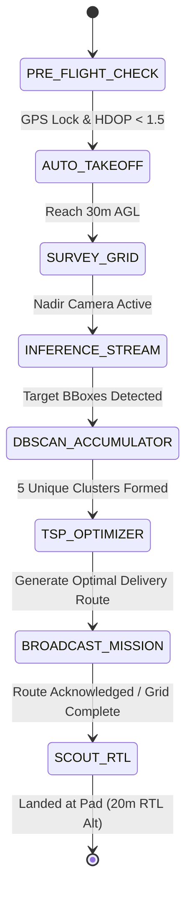
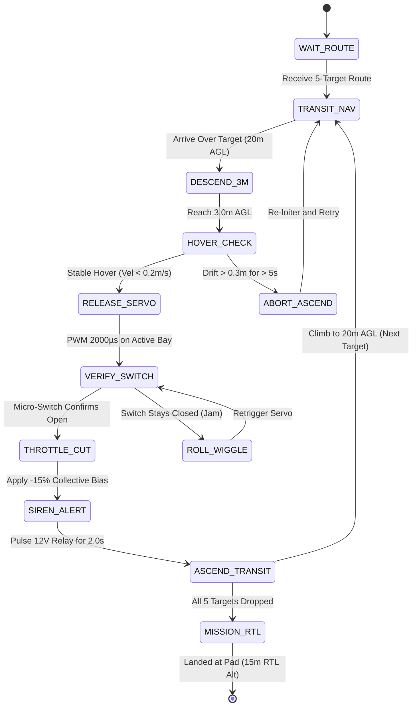

# NIDAR 2-Drone System Design & Autonomy Architecture

**System Classification:** Technical System Specification & Algorithmic Design  
**Target:** 2-Drone Qualifying Round Architecture  
- **Drone 1:** Jetson Orin Nano Super AI Scout Quadcopter (`SYSID: 1`)  
- **Drone 2:** Raspberry Pi 5 5-Bay Delivery Hexacopter (`SYSID: 2`)  

---

## 1. Scout Drone (Drone 1) Autonomy & Vision Engine

### 1.1 Scout Autonomous State Machine
The Scout quadcopter runs an onboard autonomous flight sequencer coordinating search and inference:

1. **PRE_FLIGHT_CHECK:** Validates IMU calibration, u-blox M9N 3D lock (HDOP < 1.5), and POSIX ring buffer `/dev/shm/scout_detections`.
2. **AUTO_TAKEOFF:** Autonomous climb to 30.0m AGL at 2.5 m/s.
3. **SURVEY_GRID:** Executes pre-computed lawnmower search pattern at 10 m/s cruise across designated search polygon.
4. **INFERENCE_STREAM:** Arducam IMX477 captures 1080p@30FPS; TensorRT INT8 YOLOv8 engine processes frames in < 9ms, writing 32-byte records to shared memory.
5. **DBSCAN_ACCUMULATOR:** Aggregates ground projections and clusters multiple sightings.
6. **TSP_OPTIMIZER:** Runs brute-force permutation optimizer to order targets into minimum-distance path.
7. **BROADCAST_MISSION:** Transmits ordered 5-target coordinates via 433MHz MAVLink `MISSION_ITEM_INT` to GCS / Delivery Drone.
8. **SCOUT_RTL:** Initiates Return-To-Launch at deconflicted altitude of 20.0m AGL.

---

### 1.2 Pinhole Ray-Casting Photogrammetry Math

To project a 2D image pixel $(u, v)$ to a real-world geodetic coordinate $(\text{lat}_t, \text{lon}_t)$, the system executes an attitude-compensated 3D ray-casting transformation:

#### 1. Camera Frame Vector
Given focal lengths $(f_x, f_y)$ and principal point $(c_x, c_y)$:
$$\mathbf{r}_{cam} = \begin{bmatrix} \frac{u - c_x}{f_x} \\ \frac{v - c_y}{f_y} \\ 1 \end{bmatrix}, \quad \hat{\mathbf{r}}_{cam} = \frac{\mathbf{r}_{cam}}{\|\mathbf{r}_{cam}\|}$$

#### 2. Camera-to-Body Transformation (Mounting A)
Camera is mounted looking nadir (downward) with image $x$ along body starboard ($+Y$) and image $y$ along body nose ($+X$):
$$\mathbf{R}_{c}^{b} = \begin{bmatrix} 0 & 1 & 0 \\ 1 & 0 & 0 \\ 0 & 0 & 1 \end{bmatrix}, \quad \hat{\mathbf{r}}_{body} = \mathbf{R}_{c}^{b} \hat{\mathbf{r}}_{cam}$$

#### 3. Body-to-World Rotation Matrix (NED Frame)
Using drone EKF estimated Euler angles (roll $\phi$, pitch $\theta$, yaw $\psi$):
$$\mathbf{R}_{b}^{w} = \mathbf{R}_z(\psi) \mathbf{R}_y(\theta) \mathbf{R}_x(\phi)$$
$$\hat{\mathbf{r}}_{world} = \mathbf{R}_{b}^{w} \hat{\mathbf{r}}_{body}$$

#### 4. Ground Plane Intersection ($\mathbf{Z}_{ground} = 0$)
With camera center in NED world frame $\mathbf{p}_{cam} = [N_d, E_d, -h]^T$:
$$\lambda = \frac{0 - (-h)}{\hat{\mathbf{r}}_{world, z}} = \frac{h}{\hat{\mathbf{r}}_{world, z}}$$
$$\mathbf{p}_{ground, NED} = \mathbf{p}_{cam} + \lambda \hat{\mathbf{r}}_{world} = \begin{bmatrix} N_d + \lambda \hat{\mathbf{r}}_{world, x} \\ E_d + \lambda \hat{\mathbf{r}}_{world, y} \\ 0 \end{bmatrix}$$

#### 5. WGS-84 Geodetic Coordinate Conversion
$$\text{lat}_t = \text{lat}_d + \left(\frac{N_t - N_d}{R_\oplus}\right) \times \frac{180}{\pi}$$
$$\text{lon}_t = \text{lon}_d + \left(\frac{E_t - E_d}{R_\oplus \cos(\text{lat}_d \cdot \pi/180)}\right) \times \frac{180}{\pi}$$
where $R_\oplus = 6,371,000\text{ m}$.

---

### 1.3 2.5m DBSCAN Spatial Deduplication

During grid survey, a survivor is detected across dozens of overlapping video frames from varying angles:
- **Epsilon ($\varepsilon$):** $2.5\text{ m}$ (matches the physical spread and GPS noise floor).
- **Min Samples ($MinPts$):** $3$ consecutive detections required to confirm a valid survivor target.
- **Metric:** Euclidean distance on horizontal NED ground coordinates $(N, E)$.
- **Noise Rejection:** Detections with label $-1$ (outliers/transient false positives) are purged.
- **Target Centroid Extraction:** The final target coordinate is computed as the geometric mean of core cluster points:
  $$\mathbf{C}_k = \frac{1}{|S_k|} \sum_{i \in S_k} \mathbf{p}_i$$

---

### 1.4 5-Target Traveling Salesperson Problem (TSP) Solver

Once exactly 5 unique clusters are identified, Drone 1 solves the path optimization problem:
- **Cost Function:** Euclidean flight path length:
  $$D = d(\mathbf{P}_{launch}, \mathbf{T}_{\pi(1)}) + \sum_{i=1}^{4} d(\mathbf{T}_{\pi(i)}, \mathbf{T}_{\pi(i+1)})$$
- **Complexity:** For $N = 5$ targets, permutation space $|P| = 5! = 120$ combinations.
- **Computation Time:** Evaluates all 120 paths in $< 0.4\text{ ms}$ on the Jetson CPU.
- **Result:** Guarantees absolute global minimum flight distance, saving critical battery energy on Drone 2.

---

## 2. Delivery Drone (Drone 2) Precision Drop Subsystem

### 2.1 3m Precision Drop State Machine

---

### 2.2 Alternating Bay Sequence for Center of Gravity (CG) Balance

The 5-bay magazine rack is mounted along the central longitudinal axis of the hexacopter:
- **Bay Positions:** Bay 1 (Front), Bay 2 (Mid-Front), Bay 3 (Center), Bay 4 (Mid-Rear), Bay 5 (Rear).
- **Problem:** Sequential releasing ($1 \to 2 \to 3 \to 4 \to 5$) shifts the hexacopter Center of Gravity (CG) rearward by up to 48mm, straining rear ESCs and inducing pitch oscillation.
- **Solution:** Alternating symmetrical release sequence:
  $$\text{Sequence} = [\mathbf{1}, \mathbf{5}, \mathbf{2}, \mathbf{4}, \mathbf{3}]$$
  - Drop 1 (Bay 1): Releases 200g front.
  - Drop 2 (Bay 5): Immediately counterbalances by releasing 200g rear.
  - Drop 3 (Bay 2): Releases mid-front.
  - Drop 4 (Bay 4): Releases mid-rear.
  - Drop 5 (Bay 3): Releases exact center.
  - **Result:** Frame CG stays within $\pm 4.2\text{ mm}$ of geometric center throughout entire delivery sortie.

---

### 2.3 Anti-Bounce Throttle Compensation

When a 200g parcel is released from a 5.5 kg hexacopter, the sudden drop in mass produces excess thrust:
$$\Delta a_z = \frac{\Delta m \cdot g}{m_{drone} - \Delta m} \approx \frac{0.2 \times 9.81}{5.3} \approx 0.37\text{ m/s}^2$$
In ground effect at 3m altitude, this causes an unwanted vertical ballooning of $0.5 - 0.8\text{ m}$.
- **Compensation Algorithm:** The instant the micro-switch confirms parcel detachment, the mission controller commands a **15% downward collective throttle bias** for $400\text{ ms}$, offsetting the upward acceleration and holding the hexacopter locked at $3.0\text{ m} \pm 0.05\text{ m}$.

---

### 2.4 GPIO Micro-Switch Verification & Pinout

Each payload bay contains an Omron ultra-subminiature micro-switch wired to Raspberry Pi 5 GPIO pins:
- **Bay 1:** GPIO 17
- **Bay 2:** GPIO 27
- **Bay 3:** GPIO 22
- **Bay 4:** GPIO 23
- **Bay 5:** GPIO 24
- **12V Siren Relay:** GPIO 25

**Logic:**
- Parcel Present: Switch depressed $\to$ Circuit closed (`LOW`).
- Parcel Released: Switch lever extends $\to$ Circuit open (`HIGH`).

---

### 2.5 5-Second Unstable Hover Abort

At 3.0m drop altitude, ground turbulence or wind gusts can cause horizontal drift:
- If horizontal ground speed $> 0.3\text{ m/s}$ or position error $> 0.35\text{ m}$, drop is inhibited.
- If the drone fails to establish steady hover within **5.0 seconds**, the controller triggers **HOVER ABORT**:
  1. Instantly commands rapid climb to 20m transit altitude.
  2. Loiters for 10 seconds to re-stabilize EKF.
  3. Re-enters precision descent approach.

---

### 2.6 Roll-Wiggle Unjamming Routine

If a parcel gets wedged due to dust, debris, or mechanical friction:
1. Micro-switch remains `LOW` 500ms after servo trigger.
2. Controller commands roll oscillation via MAVLink `SET_ATTITUDE_TARGET`:
   - $+10^\circ$ roll for $250\text{ ms}$
   - $-10^\circ$ roll for $500\text{ ms}$
   - $+10^\circ$ roll for $250\text{ ms}$
   - Level attitude
3. Inertial lateral force $\approx 0.17g$ breaks surface friction.
4. Servo pulse re-asserted.
5. Micro-switch re-verified.
