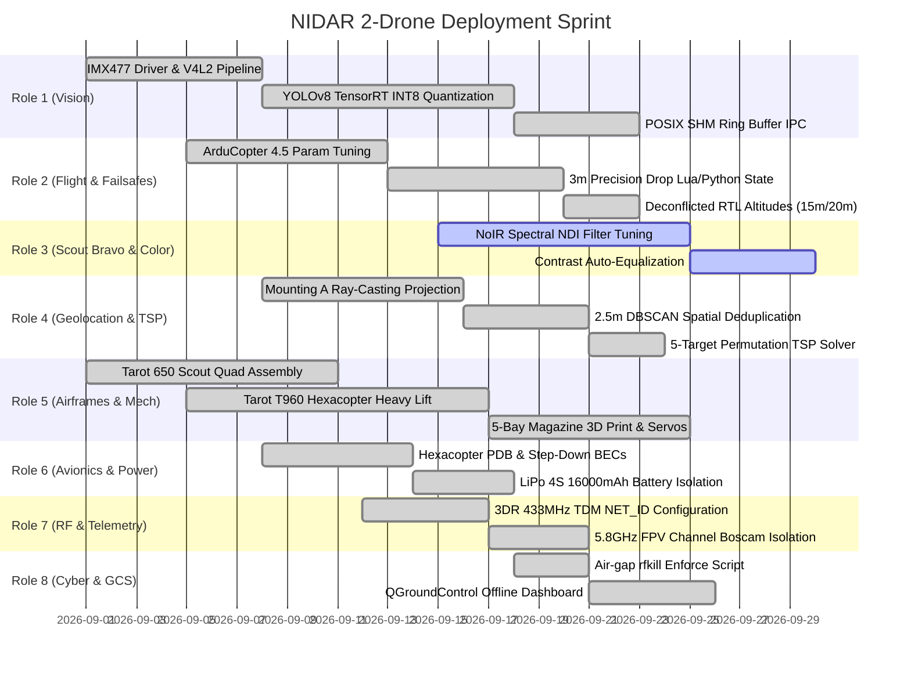

# NIDAR RescueSwarm — Sprint Backlog & Role Matrix

**Document Classification:** Engineering Sprint Backlog & Role Allocations  
**Sprint Cycle:** Qualifying Round Preparation  

---

## 🏃 Sprint Overview by Role

---

## 📋 Role Task Breakdowns

### 💻 Role 1: Edge AI Pipeline Architect
- [x] **TASK-R1-01:** Integrate GStreamer pipeline for IMX477 on Jetson Orin Nano Super.
- [x] **TASK-R1-02:** Quantize YOLOv8s to INT8 with TensorRT calibration cache (`yolov8s_sar_int8.engine`).
- [x] **TASK-R1-03:** Construct POSIX Shared Memory zero-copy ring buffer (`/dev/shm/scout_detections`, 32 bytes/rec).
- [ ] **TASK-R1-04:** Empirical thermal stress test under sustained 30 FPS inference in ambient 35°C chamber.

### ✈️ Role 2: Autopilot, Drop Automation and Failsafes Engineer
- [x] **TASK-R2-01:** Configure ArduCopter 4.5 on Pixhawk 2.4.8 (SYSID 1 Scout, SYSID 2 Delivery).
- [x] **TASK-R2-02:** Implement 3m precision descent logic and 5s hover abort monitor.
- [x] **TASK-R2-03:** Program alternating CG bay sequence `[1, 5, 2, 4, 3]`.
- [x] **TASK-R2-04:** Implement anti-bounce collective throttle cut upon package release.
- [x] **TASK-R2-05:** Configure deconflicted RTL altitudes: 20m for Scout, 15m for Delivery.

### 📷 Role 3: Edge AI and Colourimetry Lead, Scout Bravo
- [x] **TASK-R3-01:** Build NoIR NDI (Normalized Difference Index) filtering pipeline on Raspberry Pi 5.
- [ ] **TASK-R3-02:** Calibrate color correction matrix to neutralize daylight pink tint from missing IR filter.
- [ ] **TASK-R3-03:** Validate shadow-tolerant human silhouette extraction on synthetic flood dataset.

### 🌐 Role 4: Geolocation Engine and Target Deduplication Specialist
- [x] **TASK-R4-01:** Implement 3D pinhole ray-casting with Mounting A camera-to-body matrix.
- [x] **TASK-R4-02:** Develop 2.5m DBSCAN clustering algorithm to eliminate duplicate video frame detections.
- [x] **TASK-R4-03:** Implement 5-target brute-force permutation TSP solver ($5! = 120$ paths, $<0.4\text{ ms}$).
- [x] **TASK-R4-04:** Stream confirmed target waypoints over MAVLink to GCS and Delivery Hexacopter.

### 🛠️ Role 5: Airframe Builder and Propulsion Lead
- [x] **TASK-R5-01:** Assemble Tarot 650 Sport carbon fiber frame for Scout Drone 1.
- [x] **TASK-R5-02:** Assemble Tarot T960 hexacopter frame with T-Motor MN3508 propulsion.
- [x] **TASK-R5-03:** Design and 3D print 5-bay underslung magazine rack with Emax ES08MD II metal gear servos.
- [ ] **TASK-R5-04:** Perform 50-cycle drop reliability test under 200g simulated payload load.

### ⚡ Role 6: Avionics and Power Distribution Lead
- [x] **TASK-R6-01:** Solder heavy-duty PDB handling 6S/4S high-discharge LiPo battery.
- [x] **TASK-R6-02:** Install isolated 5V/5A BEC for Pixhawk and 5V/3A BEC for companion computers.
- [x] **TASK-R6-03:** Mount flight controllers on silicone anti-vibration damping platforms.
- [ ] **TASK-R6-04:** Measure voltage ripple on oscilloscope during maximum motor throttle bursts.

### 📡 Role 7: RF Hardware and Wiring Integration Lead
- [x] **TASK-R7-01:** Install 3DR 433MHz SiK telemetry radios on all nodes with `NET_ID = 25` and 50 TDM channels.
- [x] **TASK-R7-02:** Mount Boscam 5.8GHz analog VTXs with circular polarized cloverleaf antennas.
- [x] **TASK-R7-03:** Route power lines $> 50\text{ mm}$ away from GPS and compass wiring to eliminate EMI.

### 🔒 Role 8: Cybersecurity, RF Defence and Ground Control Station Engineer
- [x] **TASK-R8-01:** Deploy `rfkill block all` air-gap enforcement systemd service.
- [x] **TASK-R8-02:** Configure QGroundControl and MAVProxy for multi-vehicle tracking (`SYSID 1, 2, 255`).
- [x] **TASK-R8-03:** Set up offline Docker daemon configurations with `pull_policy: never`.
- [x] **TASK-R8-04:** Verify zero-manual-intervention audit trail via MAVLink mission logging.
